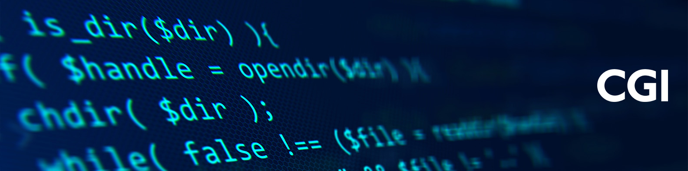

# [Paul Saunders](https://github.com/cgi-psaunders)
## Senior DevOps Engineer, Secure Mission Critical Solutions at CGI
- 👀 Interested in [DevOps](https://github.com/topics/devops), [Infrastructure as Code](https://github.com/topics/infrastructure-as-code) and generally automating the boring bits.
- 🌱 I’m currently learning [Docker Swarm](https://docs.docker.com/engine/swarm/), [Kubernetes](https://www.siderolabs.com/talos-linux), [OpenStack](https://docs.openstack.org/), [Proxmox](https://www.proxmox.com/) and some firewalling.
- 🗬 I have worked in mission critical and embedded systems, I have designed datacentres, I regularly deploy VMWare and Proxmox.
- 📫 How to reach me: p.saunders@cgi.com
<!-- - 💞️ I’m looking to collaborate on ... -->

<!---
cgi-psaunders/cgi-psaunders is a ✨ special ✨ repository because its `README.md` (this file) appears on your GitHub profile.
You can click the Preview link to take a look at your changes.
--->
